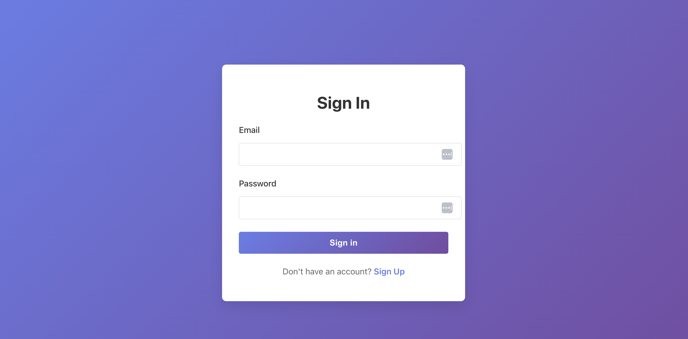
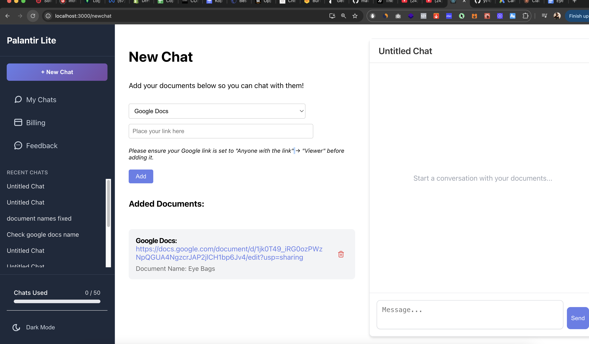
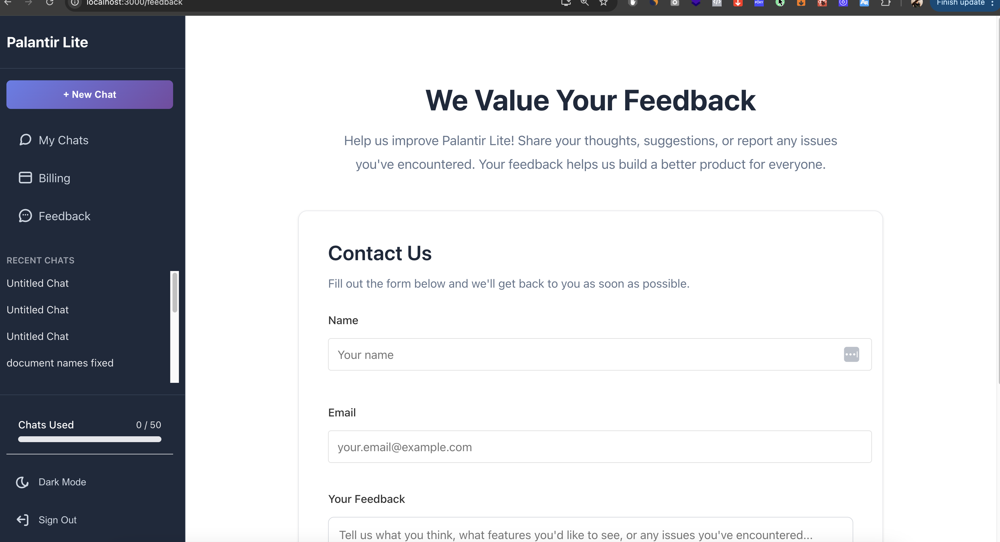

Palantir Lite

App Overview

Palantir Lite is a React + Node.js application that allows users to upload documents (PDFs, Google Docs, Google Sheets, Notion pages) and interact with an AI assistant to extract, summarize, and answer questions based on the uploaded content. Users can also transcribe YouTube audio to text using OpenAI’s Whisper API.

Here's the link to access:

--------------------

Screenshots

Sign in Page

New Chat Page

Feedback Page

Billing page

-----------------
API Endpoints

Auth Routes

API Routes

------------
Technologies Used

Frontend:
- React 18.3.1 - JavaScript library for building user interfaces
- React Router DOM 7.1.1 - Client-side routing
- Axios 1.7.9 - HTTP client for API requests
- TypeScript 5.6.2 - Static type checking
- Vite 6.0.1 - Build tool and development server

Backend:
- Node.js - JavaScript runtime environment
- Express.js 4.21.2 - Web application framework
- MongoDB - NoSQL database
- Mongoose 8.9.3 - MongoDB object modeling
- TypeScript 5.7.2 - Static type checking

Authentication & Security:
- JSON Web Tokens (JWT) - Token-based authentication
- bcryptjs 2.4.3 - Password hashing
- dotenv 16.4.7 - Environment variable management

AI & External APIs:
- OpenAI API (gpt-3.5-turbo, Whisper) - AI chat completions and audio transcription
- Google Docs/Sheets API - Document content extraction
- Notion API - Page content scraping

Additional Libraries:
- ytdl-core 4.11.5 - YouTube video downloading
- yt-dlp-exec 1.0.3 - YouTube audio extraction
- cheerio 1.0.0 - HTML parsing for Notion pages
- pdf-parse 1.1.1 - PDF text extraction
- cors 2.8.5 - Cross-origin resource sharing
- multer 1.4.5-lts.1 - File upload handling

Design System:
- shadcn/ui - Black and white component design system
- Custom CSS with dark mode support

--------------

Attributions

OpenAI. (2024). ChatGPT (GPT-3.5-turbo) [Large language model]. https://openai.com/chatgpt

OpenAI. (2024). Whisper API [Audio transcription model]. https://platform.openai.com/docs/guides/speech-to-text

Google LLC. (2024). Google Docs API [Web service]. https://developers.google.com/docs/api

Google LLC. (2024). Google Sheets API [Web service]. https://developers.google.com/sheets/api

Notion Labs, Inc. (2024). Notion API [Web service]. https://developers.notion.com/

shadcn. (2024). shadcn/ui [UI component library]. https://ui.shadcn.com/

This project was developed with assistance from AI tools including Claude (Anthropic) and ChatGPT (OpenAI) for code generation, debugging, and documentation.

--------------

Key features:
	•	Upload and manage multiple document types (PDF, Google Docs/Sheets, Notion).
	•	Chat with AI based on uploaded documents.
	•	Transcribe YouTube videos to text.
	•	JWT-based authentication for secure user access.
	•	Save chat histories with associated documents in MongoDB.
	•	Simple, intuitive React frontend with Express backend.

Next Steps / Improvements
	•	Add subscription and billing integration via Stripe.
	•	Enable real-time updates for Google Docs/Sheets and Notion pages.
	•	Integrate AI-powered summarization and enhanced search capabilities.
	•	Improve UI/UX for smoother multi-platform navigation.
	•	Implement role-based access control and enhanced security for sensitive documents.